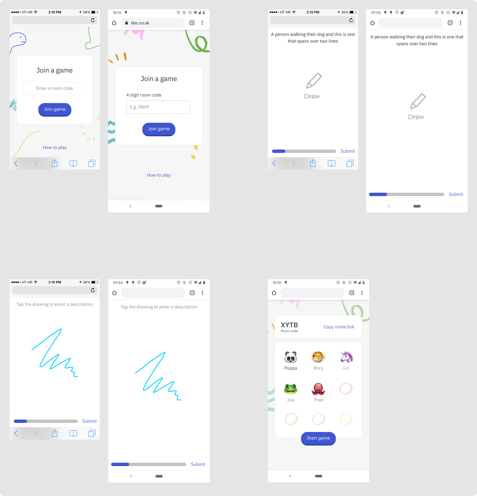

# Flying fish sticks

A game based on [Eat Poop You Cat](http://www.annarbor.com/entertainment/eat-poop-you-cat-telestrations-review/) - something like a cross between [the telephone game](https://en.wikipedia.org/wiki/Telephone_(game)) and [pictionary](https://en.wikipedia.org/wiki/Pictionary).

This is a work in progress. 

[Server repository](https://reactjs.org/)

### Proof of concept

I built a proof of concept to learn Socket.io, figure out how I was going to build the app and demonstrate gameplay.

[Proof of concept repository](https://reactjs.org/)

(This GIF might take a little bit to load).

### Tech
- [React](https://reactjs.org/)
- [Node](https://nodejs.org/en/) (with [Express](https://expressjs.com/))
- [Socket.io](https://socket.io/)
- [Canvas Web API](https://developer.mozilla.org/en-US/docs/Web/API/Canvas_API)

### UI Exploration
